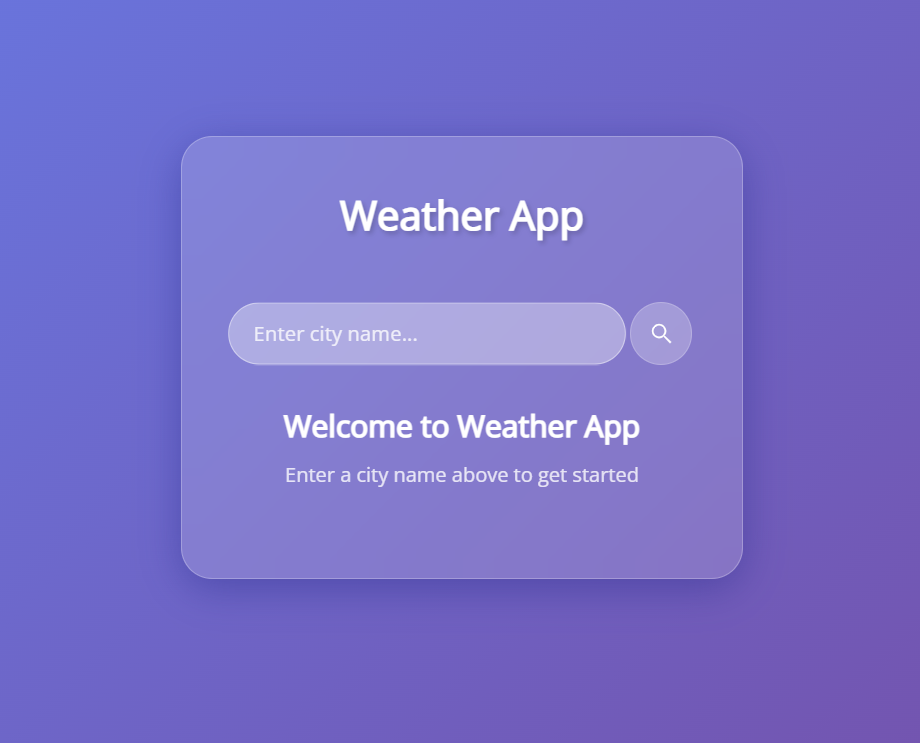
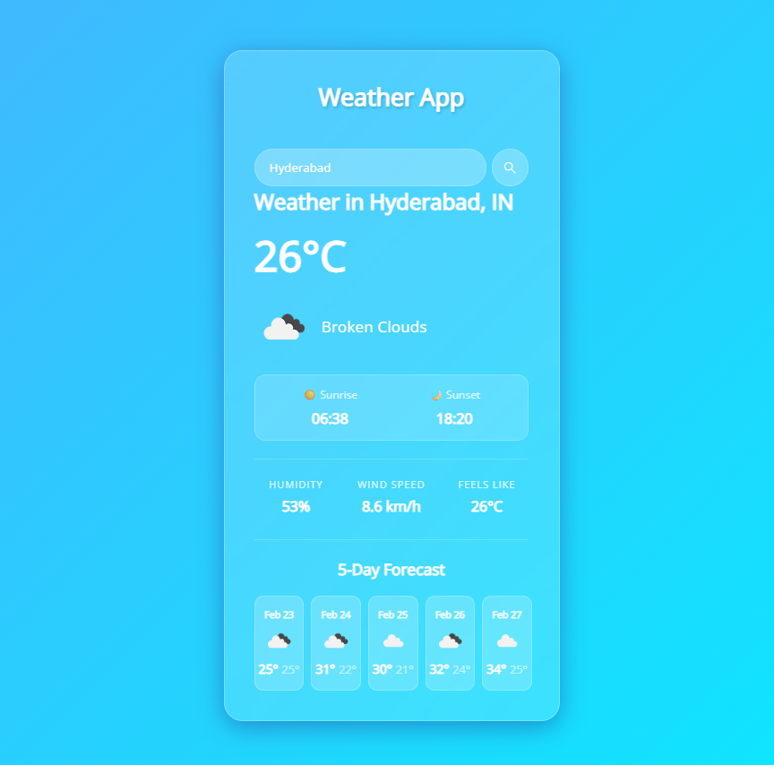

# Weather App

A clean and modern weather application that provides real-time weather information and forecasts for any city worldwide.

## Features

- **Current Weather**: Get real-time weather data including temperature, humidity, wind speed, and weather conditions
- **5-Day Forecast**: View upcoming weather with daily min/max temperatures
- **Sunrise & Sunset Times**: See accurate sunrise and sunset times for any location
- **Dynamic Backgrounds**: Background gradients change based on weather conditions
- **Responsive Design**: Works seamlessly on desktop and mobile devices
- **Error Handling**: User-friendly error messages for invalid city names

## Tech Stack

- **HTML5**: Structure and semantic markup
- **CSS3**: Modern styling with glassmorphism effects
- **JavaScript (ES6)**: Dynamic functionality and API integration
- **OpenWeather API**: Real-time weather data

## Live Demo

🌐 **[View Live Demo](https://weather-app-xi-ashy-48.vercel.app/)**

Try it now! Search for any city worldwide to see real-time weather data and forecasts.

## Screenshots

### Home Screen

*Welcome screen with search functionality*

### Weather Display

*Complete weather information with current conditions, sunrise/sunset times, and 5-day forecast*

---

**Note:** To add your screenshots:
1. Save your screenshots as `home.png` and `output.png` in the `screenshots` folder
2. Commit and push to GitHub

Alternatively, you can use image hosting services like Imgur and replace the paths with direct URLs.

## Setup Instructions

1. **Clone the repository**
   ```bash
   git clone https://github.com/Abhishek13501/weather-app.git
   cd weather-app
   ```

2. **Get your API key**
   - Visit [OpenWeatherMap](https://openweathermap.org/api)
   - Sign up for a free account
   - Generate your API key

3. **Configure the API key**
   - Open `Weather.js`
   - Replace `YOUR_API_KEY` with your actual API key:
   ```javascript
   const WEATHER_API_KEY = "your_api_key_here";
   ```

4. **Run the application**
   - Simply open `Weather.html` in your web browser
   - Or use a local server:
   ```bash
   # Using Python
   python -m http.server 8000
   
   # Using Node.js
   npx serve
   ```

5. **Start using**
   - Enter any city name in the search bar
   - Press Enter or click the search button
   - View current weather and 5-day forecast

## API Usage

This app uses the free tier of OpenWeather API:
- Current Weather API: `api.openweathermap.org/data/2.5/weather`
- 5-Day Forecast API: `api.openweathermap.org/data/2.5/forecast`

## Browser Support

- Chrome (latest)
- Firefox (latest)
- Safari (latest)
- Edge (latest)

## Author

Abhishek Kethepally

## Acknowledgments

- Weather data provided by [OpenWeatherMap](https://openweathermap.org/)
- Icons from OpenWeatherMap
